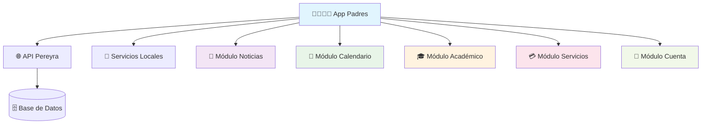

# 👨‍👩‍👧‍👦 App Padres Pereyra - Portal Familiar Móvil

<div align="center">


**🏆 Aplicación móvil multiplataforma para padres de familia**  
*Conectando familias con el progreso educativo de sus hijos*

</div>

---

## 🎯 **Descripción del Proyecto**

**App Padres Pereyra** es una aplicación móvil desarrollada en **.NET MAUI** que permite a los padres de familia mantenerse conectados y al día con la vida académica de sus hijos. La aplicación ofrece un portal completo para el seguimiento educativo, financiero y comunicacional con la institución.

<div align="center">

### 🏗️ **Arquitectura de la Aplicación**



</div>

---

## 📱 **Funcionalidades Principales**

### 📰 **Centro de Noticias**
- 📢 **Comunicados oficiales** de la institución
- 🔔 **Notificaciones push** en tiempo real
- 📌 **Marcado de lectura** para seguimiento
- 🔍 **Filtros avanzados** por tipo y fecha
- 🔗 **Enlaces externos** para información adicional

### 📅 **Calendario Académico Interactivo**
- 📅 **Vista mensual/semanal** de eventos
- 🎯 **Eventos personalizados** por estudiante
- 📲 **Integración con calendario** del dispositivo
- 🎨 **Códigos de color** por tipo de evento
- ⏰ **Recordatorios automáticos**

### 🎓 **Seguimiento Académico Completo**
- 📚 **Materias por estudiante** con detalles
- 📊 **Calificaciones en tiempo real** por período
- ❌ **Control de inasistencias** detallado
- 📈 **Reportes de rendimiento** académico
- 📋 **Reportes conductuales** y comportamiento
- 🎯 **Calificaciones por criterio** de evaluación

### 💳 **Centro de Servicios Financieros**
- 💰 **Pagos pendientes** (colegiaturas, inscripciones)
- 💳 **Integración con Openpay** para pagos en línea
- 📄 **Historial de transacciones**
- 🏆 **Información de academias** disponibles
- 📞 **Directorio escolar** completo

### 👤 **Gestión de Cuenta Personal**
- 🔐 **Inicio de sesión seguro** con JWT
- 🔄 **Cambio de contraseña**
- 🎨 **Personalización de tema** (claro/oscuro)
- 🔒 **Configuración de privacidad**
- 📱 **Gestión de múltiples hijos**

---

## 🛠️ **Stack Tecnológico**

<div align="center">

| **Framework** | **UI/UX** | **Servicios** | **Herramientas** |
|:-------------:|:---------:|:-------------:|:----------------:|
| 📱 .NET MAUI 8 | 🎨 XAML | 🌐 HttpClient | 🔧 Syncfusion |
| ⚡ C# 12 | 🧩 MVVM Pattern | 🔐 JWT Auth | 🛠️ CommunityToolkit |
| 🎯 Multi-Platform | 📊 DataGrid | 📡 REST API | 📧 Mopups |

</div>

### 📦 **Dependencias y Paquetes**

```xml
<!-- UI y Funcionalidad -->
<PackageReference Include="CommunityToolkit.Maui" Version="7.0.1" />
<PackageReference Include="Mopups" Version="1.3.1" />
<PackageReference Include="Plugin.Maui.Calendar" Version="1.2.2" />

<!-- Syncfusion Components -->
<PackageReference Include="Syncfusion.Maui.Core" Version="29.2.5" />
<PackageReference Include="Syncfusion.Maui.DataGrid" Version="29.2.5" />
<PackageReference Include="Syncfusion.Maui.ListView" Version="29.2.5" />
<PackageReference Include="Syncfusion.Maui.Picker" Version="29.2.5" />
<PackageReference Include="Syncfusion.Maui.Popup" Version="29.2.5" />

<!-- Servicios Específicos -->
<PackageReference Include="Acr.UserDialogs" Version="8.0.1" />
```

---

## 🚀 **Instalación y Configuración**

### **Prerrequisitos**
- 🖥️ **Visual Studio 2022** (v17.8 o superior)
- 📱 **.NET 8.0 SDK**
- 🔧 **Workload .NET MAUI** instalado
- 📱 **Android SDK** (API 21+) / **iOS SDK** (iOS 11+)

### **1. Clonación del Repositorio**
```bash
git clone https://github.com/tu-usuario/AppPadrePereyra.git
cd AppPadrePereyra
```

### **2. Configuración del Proyecto**
```bash
# Restaurar dependencias
dotnet restore

# Verificar instalación de workloads
dotnet workload list
```

### **3. Configuración de API Routes**
Editar `Constants/ApiRoutes.cs`:
```csharp
public const string BaseUrl = "TU_URL_API_AQUI";
```

### **4. Licencia Syncfusion**
Configurar en `MauiProgram.cs`:
```csharp
Syncfusion.Licensing.SyncfusionLicenseProvider.RegisterLicense("TU_LICENCIA_AQUI");
```

---

## 🏃‍♂️ **Ejecución de la Aplicación**

### **📱 Plataforma Android**
```bash
dotnet build -t:Run -f net8.0-android
```

### **🍎 Plataforma iOS**
```bash
dotnet build -t:Run -f net8.0-ios
```

### **🖥️ Plataforma Windows**
```bash
dotnet build -t:Run -f net8.0-windows10.0.19041.0
```

---

## 📐 **Arquitectura del Proyecto**

```
📂 AppPadrePereyra/
├── 📂 EscolarAppPadres/                    # Proyecto Principal
│   ├── 📂 Constants/                       # Configuraciones
│   │   └── 📄 ApiRoutes.cs                # URLs de API
│   ├── 📂 Services/                        # Servicios HTTP
│   │   ├── 📄 FatherLoginService.cs       # Autenticación padres
│   │   ├── 📄 StudentLoginService.cs      # Autenticación estudiantes  
│   │   ├── 📄 NewsService.cs              # Servicio de noticias
│   │   ├── 📄 EventService.cs             # Servicio de eventos
│   │   ├── 📄 GradeService.cs             # Servicio de calificaciones
│   │   ├── 📄 PaymentsService.cs          # Servicio de pagos
│   │   └── 📄 SubjectsService.cs          # Servicio de materias
│   ├── 📂 ViewModels/                      # MVVM ViewModels
│   │   ├── 📂 News/                        # ViewModels de noticias
│   │   ├── 📂 Subjects/                    # ViewModels académicos
│   │   └── 📂 Login/                       # ViewModels de autenticación
│   ├── 📂 Views/                           # Interfaces XAML
│   │   ├── 📂 News/                        # 📰 Pantallas de noticias
│   │   ├── 📂 Calendar/                    # 📅 Pantallas de calendario
│   │   ├── 📂 School/                      # 🎓 Pantallas académicas
│   │   │   ├── 📄 SubjectsView.xaml       # Vista de materias
│   │   │   ├── 📄 QualificationsView.xaml # Vista de calificaciones
│   │   │   ├── 📄 AbsencesView.xaml       # Vista de inasistencias
│   │   │   └── 📄 ConductualView.xaml     # Vista conductual
│   │   ├── 📂 Service/                     # 💳 Pantallas de servicios
│   │   │   ├── 📄 PendingPaymentsView.xaml # Pagos pendientes
│   │   │   └── 📄 DirectoryView.xaml      # Directorio escolar
│   │   ├── 📂 Account/                     # 👤 Pantallas de cuenta
│   │   └── 📂 Login/                       # 🔐 Pantallas de login
│   ├── 📂 Models/                          # Modelos de datos
│   ├── 📂 Helpers/                         # Clases auxiliares
│   ├── 📂 Platforms/                       # Código específico por plataforma
│   │   ├── 📂 Android/                     # Servicios Android
│   │   ├── 📂 iOS/                         # Servicios iOS
│   │   └── 📂 Windows/                     # Servicios Windows
│   ├── 📄 App.xaml                         # Configuración global
│   ├── 📄 AppShell.xaml                    # Navegación principal
│   └── 📄 MauiProgram.cs                   # Punto de entrada
└── 📄 EscolarAppPadres.sln                # Solución de Visual Studio
```

---

## 🔥 **Características Técnicas Destacadas**

### **🎨 Experiencia de Usuario**
- 🌙 **Modo claro/oscuro** personalizable
- 📱 **Diseño responsivo** para todas las pantallas
- ⚡ **Navegación fluida** con animaciones
- 🎯 **Interfaz intuitiva** siguiendo Material Design
- 🔄 **Actualización automática** de datos

### **🔒 Seguridad y Autenticación**
- 🔐 **JWT Authentication** con refresh tokens
- 🛡️ **Validación de certificados SSL**
- 👥 **Autenticación dual** (padres y estudiantes)
- 🔄 **Gestión automática de sesiones**
- 📱 **Almacenamiento seguro** local

### **📊 Funcionalidades Avanzadas**
- 📈 **Gráficos interactivos** de calificaciones
- 🔍 **Búsqueda y filtrado** avanzado
- 📄 **Exportación de reportes** 
- 🔔 **Notificaciones push** personalizadas
- 📱 **Integración con calendario** nativo
- 💳 **Pagos en línea** con Openpay

### **⚡ Rendimiento**
- 🚀 **Carga asíncrona** de datos
- 💾 **Caché local** para modo offline
- 🔄 **Sincronización automática**
- ⏱️ **Timeouts configurables**
- 📱 **Optimización de memoria**

---

## 🔌 **Integración con API**

La aplicación se conecta a una API REST desarrollada en **.NET 8** que proporciona:

### **Endpoints Principales**
- 🔐 `/api/Pereyra/Login` - Autenticación
- 📰 `/api/Pereyra/News` - Noticias
- 📅 `/api/Pereyra/Calendar` - Eventos
- 🎓 `/api/Pereyra/Student` - Datos académicos
- 💳 `/api/Pereyra/Payments` - Pagos

### **Autenticación JWT**
```csharp
// Configuración automática en servicios
_httpClient.DefaultRequestHeaders.Authorization = 
    new AuthenticationHeaderValue("Bearer", token);
```

---

## 🎯 **Casos de Uso Principales**

### **👨‍👩‍👧‍👦 Para Padres de Familia**
1. **📱 Acceso Inmediato** - Login seguro con credenciales institucionales
2. **📊 Dashboard Personalizado** - Vista general del progreso de todos los hijos
3. **🔔 Alertas Importantes** - Notificaciones de eventos y comunicados
4. **💰 Gestión Financiera** - Consulta y pago de colegiaturas en línea
5. **📞 Comunicación Directa** - Acceso al directorio escolar

### **🎓 Seguimiento Académico**
1. **📚 Materias Activas** - Lista completa de asignaturas por hijo
2. **📊 Calificaciones Detalladas** - Por período y criterio de evaluación
3. **❌ Control de Asistencia** - Registro detallado de inasistencias
4. **📈 Reportes de Progreso** - Análisis del rendimiento académico
5. **📋 Reporte Conductual** - Seguimiento del comportamiento

---

## 📊 **Métricas del Proyecto**

<div align="center">

| **Estadística** | **Valor** |
|:---------------:|:---------:|
| 📄 **Archivos XAML** | 30+ vistas |
| ⚡ **Servicios HTTP** | 15+ endpoints |
| 🧩 **ViewModels** | 20+ componentes |
| 📱 **Plataformas** | Android, iOS, Windows |
| 🎯 **Patrón Arquitectónico** | MVVM |
| 🔧 **Dependencias** | 15+ paquetes NuGet |

</div>

---

## 👨‍💻 **Información del Desarrollador**

<div align="center">

**Gerardo Gallegos Plata**

📧 **Contacto:** [gplata@resosistemas.mx](mailto:gplata@resosistemas.mx)  
🌐 **Website:** [www.resosistemas.mx](https://www.resosistemas.mx)  
📱 **Soporte Técnico:** [gplata@resosistemas.mx](mailto:gplata@resosistemas.mx) 

---

### **🎯 Tecnologías Utilizadas**


---

*Desarrollado con ❤️ por RESO Sistemas*

</div>
